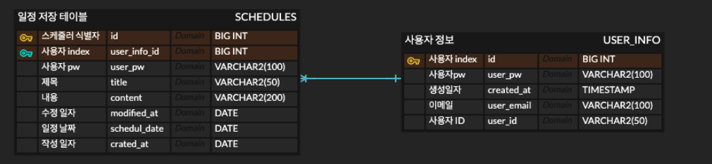

일정관리 앱 입니다.

기본적인 일정 관리 앱으로, 
SCHDEULES, USER_INFO 테이블로 구성되어 있습니다.
자세한 내용은 2. ERD 구성 사진을 참조 해 주십시오.

API 명세서는 아래 링크와 같으며, 총 5개의 기능 개발 예정입니다.

1. 일정 생성하기
2. 전체 일정 조회하기
3. 선택 일정 조회하기
4. 선택 일정 수정하기
5. 선택 일정 삭제하기

앞으로 프론트에서 데이터를 받아와서 로직을 처리하고 db에 저장한 후, 다시 데이터를 조회해 오는 실습을 진행할 생각에 가슴이 두근 세근 합니다.

----------

1. API 명세서 - Notion
url : https://elated-knife-12a.notion.site/12f291f637868060b438d028034d0796?v=46f5d893b7034c2face1b0184734c781&pvs=4

2. ERD 구성
